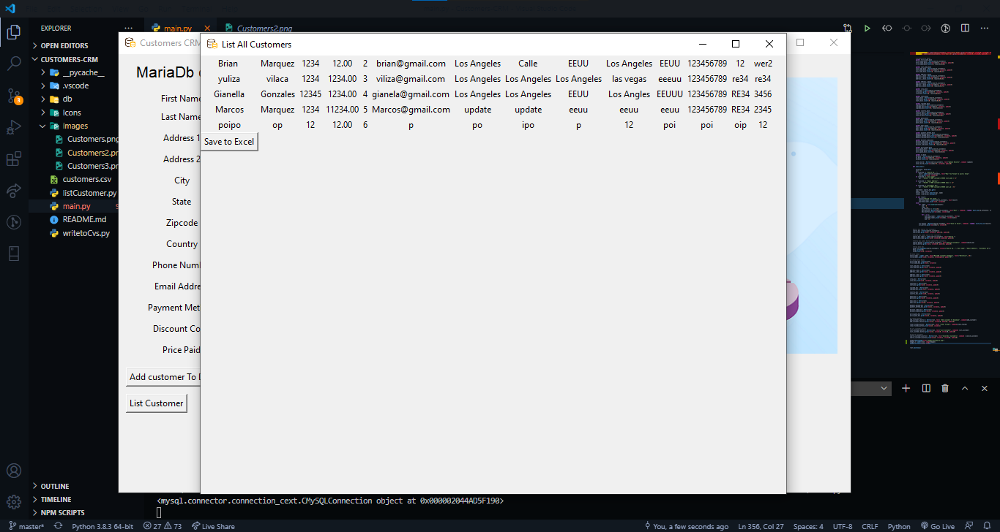
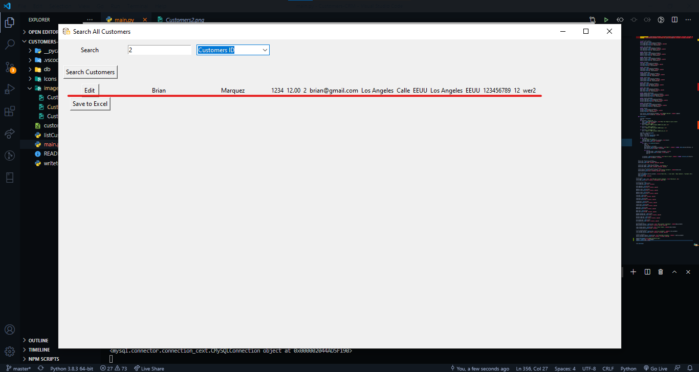
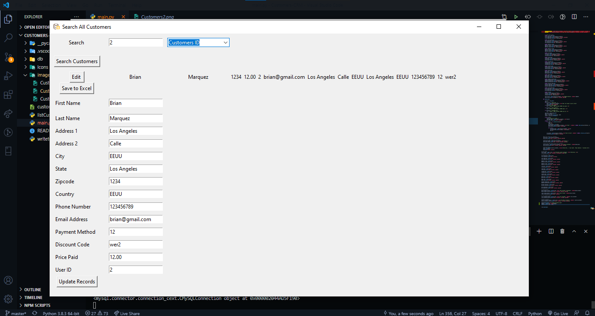
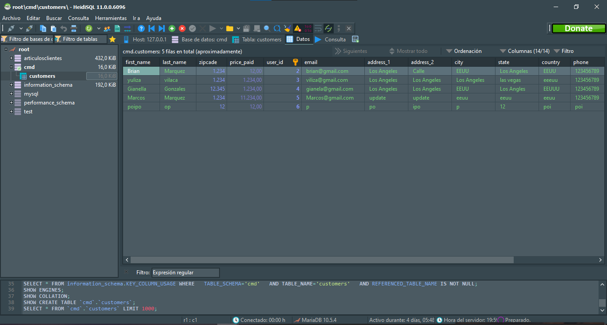

<h2 align="center">Customers CMR - Basic &nbsp;🖥🖱&nbsp;</h2>

<p align="center">
  
  <a href="https://github.com/BrianMarquez3/Customers-CRMe/tags">
    
  </a>
  <a href="https://github.com/BrianMarquez3/Customers-CRM/stargazers">
    
  </a>
  <a href="https://github.com/BrianMarquez3/Customers-CRM/network">
    
  </a> 
</p>
  


_Add Customers_

```
def add_customer():
    sql_command = "INSERT INTO customers(first_name, last_name, address_1, address_2, city, state, zipcade, country, phone, email, payment_method, dicount_code, price_paid) Values (%s, %s, %s, %s, %s, %s, %s, %s, %s, %s, %s, %s, %s)"
    values = (first_name_box.get(), last_name_box.get(), address_1_box.get() ,address_2_box.get(), city_box.get(), state_box.get(), zipcade_box.get(), country_box.get(), phone_box.get(), email_box.get(), payment_method_box.get(), dicount_code_box.get(), price_paid_box.get())
    my_cursor.execute(sql_command, values)

    mydb.commit()
    clear_fields()
```

## List All Customers



## Search All Customers



## Edith Customers



## Database Mariadb

_Conector Base de datos - MariaDB_

```
pip3 install mariadb
```


- Puerto : 3307

```
my_cursor.execute("CREATE TABLE IF NOT EXISTS customers (first_name VARCHAR(255),\
    last_name VARCHAR(255), \
    zipcade INT(10), \
    price_paid DECIMAL(10, 2),\
    user_id INT AUTO_INCREMENT PRIMARY KEY,\
    email VARCHAR(255),\
    address_1 VARCHAR(255), \
    address_2  VARCHAR(255), \
    city VARCHAR(50),\
    state VARCHAR(50),\
    country VARCHAR(255),\
    phone VARCHAR(255),\
    payment_method VARCHAR(255),\
    dicount_code VARCHAR(255))")
```

